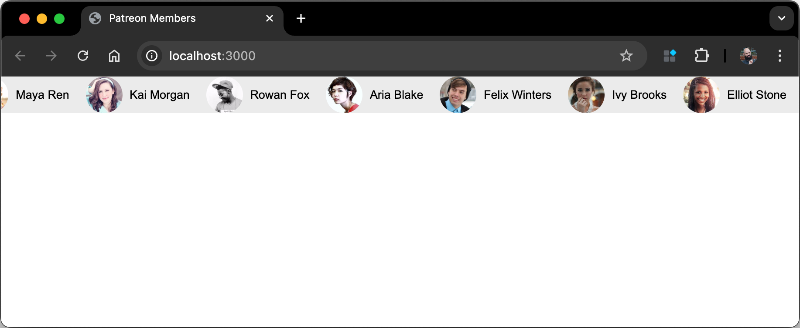

This is a simple web application that generates a scrolling banner displaying your Patreon members' names and profile pictures. The banner is designed to be used as an overlay on your streams.



This project is inspired by [patreon-banner](https://github.com/AssistantApps/Patreon-Banner)  by [Kurt Lourens](https://github.com/Khaoz-Topsy) (now deprecated).

Unlike [patreon-banner](https://github.com/AssistantApps/Patreon-Banner), this project doesn't use OAuth2.0 but downloads the members' data directly from the Patreon API using a personal access token. You will need to create a new application in your Patreon account and get an access token. 

## Quick Start Guide

1. Fork this repository to your GitHub account.
1. On the [Patreon Portal](https://www.patreon.com/portal/registration/register-clients), create a new client and get your access token.
1. Create a site on Netlify and link it to your GitHub repository.
1. Add `PATREON_ACCESS_TOKEN` and `PATREON_CAMPAIGN_ID` as environment variables in your Netlify settings.
1. Deploy the site.

## Detailed Setup Instructions

### 0. Prerequisites
- Node.js and npm
- A Patreon account
- (Optional) A web server or Netlify account for deployment

### 1. Get Your Access Token and Campaign ID

1. Log in to [Patreon Portal](https://www.patreon.com/portal/registration/register-clients) and create a new client. You can name it anything you like.
2. Note the access token from the new client you just created.
3. Retrieve your campaign ID by running the following command in your terminal:
   ```
   curl -H "Authorization: Bearer <ACCESS_TOKEN>" \
     "https://www.patreon.com/api/oauth2/v2/campaigns"
   ```
   Look for the "id" field in the response (e.g., "id": "1234567").

### 3. Save Your Access Token and Campaign ID

1. Create a `.env` file in the `config` directory with the following content:
   ```
   PATREON_ACCESS_TOKEN=your_access_token_here
   PATREON_CAMPAIGN_ID=your_campaign_id_here
   ```
> [!NOTE]
> Replace `your_access_token_here` and `your_campaign_id_here` with the values you obtained in the previous steps.

### 2. Install Dependencies

```
npm install
```   

### 4. Fetch Members Data

```
npm run fetch
```

This script will:
- retrieve a list of members and save it as `members.json` in `app/data`
- download the members' profile images and save them in the `app/data/img` folder.

### 5. Set Up Scheduled Builds on Netlify

To ensure your banner stays up-to-date with the latest Patreon members, you can set up scheduled builds on Netlify using build hooks.

1. Go to your Netlify site's settings and navigate to the **Build & Deploy** section.
2. Under **Build Hooks**, create a new build hook. You can name it something like "Scheduled Build".
3. Copy the generated URL for the build hook.
4. Save the URL in your GitHub repository secrets as `NETLIFY_BUILD_HOOK_URL`.

This setup will automatically trigger a build on Netlify at the specified schedule, ensuring your banner is always up-to-date.

## Local Testing

1. Run `npm start` to start a local server. 
2. Open `http://localhost:3000` in your browser to see the banner.

## Banner Customization

### Customize Default Settings

You can customize the banner's appearance and behavior by editing the following variables at the top of `app/index.js`:

```javascript
const defaults = {
  scrollSpeed: 50, // Default scroll speed in pixels per second
  bannerHeight: 42, // Default banner height in pixels
  backgroundColor: 'rgba(179, 179, 179, 0.246)', // Default banner background color
  paddingFactor: 0.15 // Padding as a factor of banner height
}
```

### Customization via URL Parameters

You can also customize the banner's appearance using URL parameters. The following parameters are supported:

- `scrollSpeed`: Speed at which the banner scrolls (pixels per second)
- `bannerHeight`: Height of the banner in pixels
- `paddingFactor`: Padding as a factor of banner height
- `backgroundColor`: Banner background color (in rgba format)

For example, to set the scroll speed to 100 pixels per second and the background color to red, you can use the following URL:

```
http://your-netlify-site.netlify.app/?scrollSpeed=100&backgroundColor=rgba(255,0,0,0.5)
```

#### Deploy to Netlify

1. Create a new site on Netlify and link it to your GitHub repository.
2. Set the build command to `npm run build` and the publish directory to `app`.
3. Add `PATREON_ACCESS_TOKEN` and `PATREON_CAMPAIGN_ID` as environment variables in your Netlify settings.
4. Deploy the site.

## Troubleshooting

### Checking That Your Access Token and Campaign ID are Valid

To make sure your access token and campaign ID are valid, run the following command in your terminal

> [!NOTE]
>  replace `<ACCESS_TOKEN>` and `<CAMPAIGN_ID>` with your actual access token and campaign ID.

```
curl -G \
  -H "Authorization: Bearer <ACCESS_TOKEN>" \
  --data-urlencode "include=currently_entitled_tiers" \
  --data-urlencode "fields[member]=full_name,email" \
  --data-urlencode "fields[tier]=title" \
  "https://www.patreon.com/api/oauth2/v2/campaigns/<CAMPAIGN_ID>/members"
```

This command should return a list of members and their details. If you see an error message, double-check your access token and campaign ID.